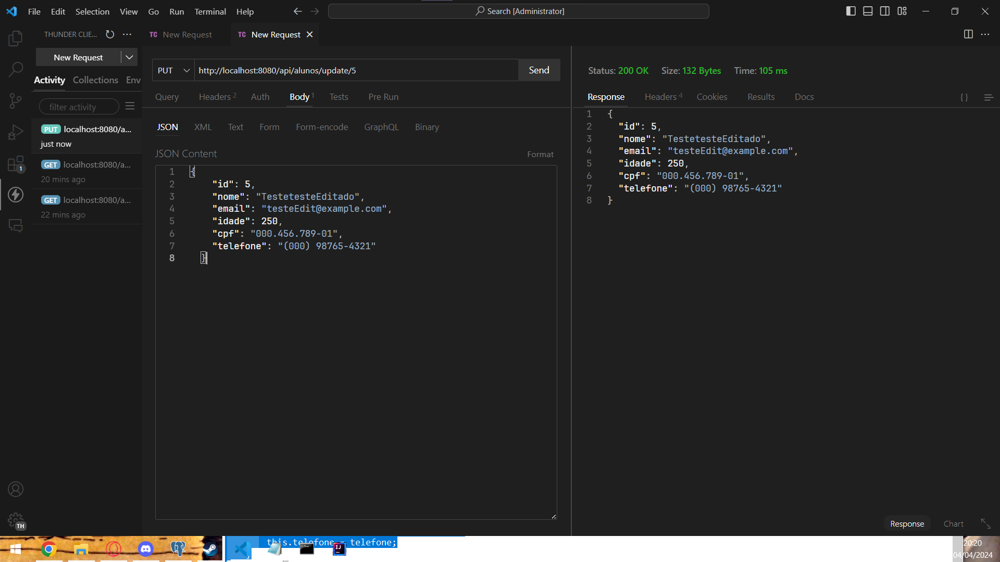

# ac1EstruturaWeb
Projeto para faculdade

# Aula 5
Nesta aula foi configurado a conexão com o banco de dados, obrigando agora criar a entidade no bd (postgreSQL)

## Get all Usando o banco

## Add pelo banco

