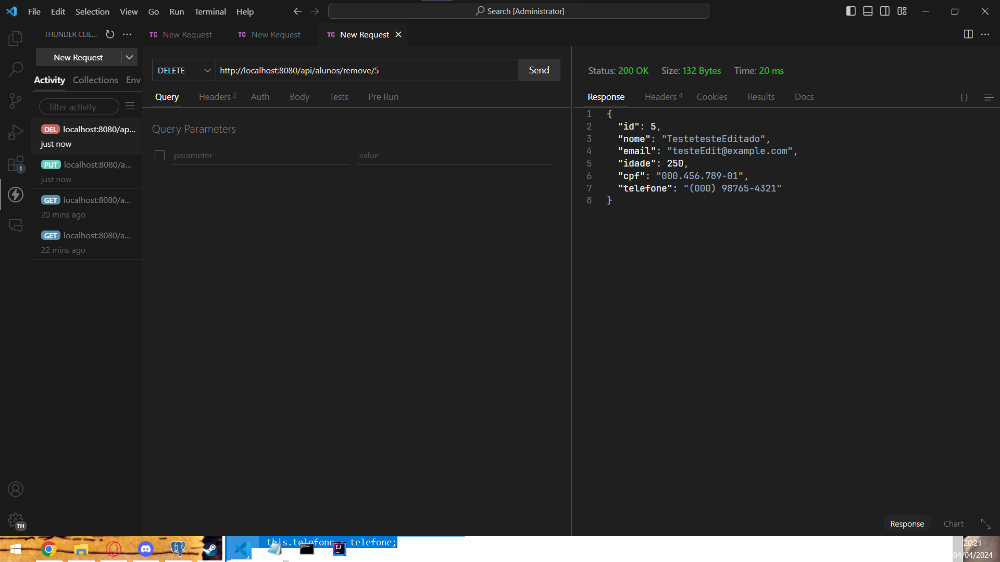

# ac1EstruturaWeb
Projeto para faculdade

# Aula 6
Nesta aula foi aplicado o Hibernate e implementado o metodo Delete e Update

## Metodo Put atualizando um aluno

Feito o update (anteriormente era apenas Teste e agora é um testeEditado)

## Metodo delete de um aluno

