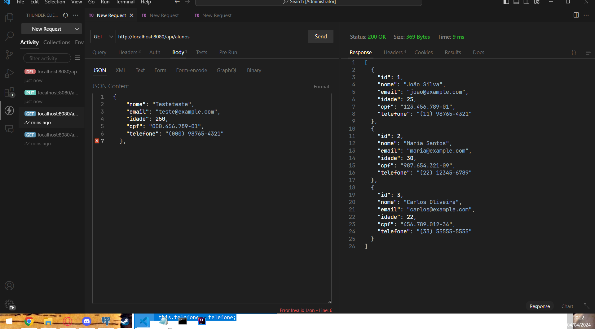

# ac1EstruturaWeb
Projeto para faculdade

# Aula 2
Utilizad a extensão do vsCode ThunderClient
Para acompanhar o conteudo da aula 2 aqui foi criado o Model de Alunos e usado ele para poder mostrar coisas no controller

Metodo get de todos os alunos agora com model

## Metodo get unitario

## Metodo post para adicionar um novo ALuno

